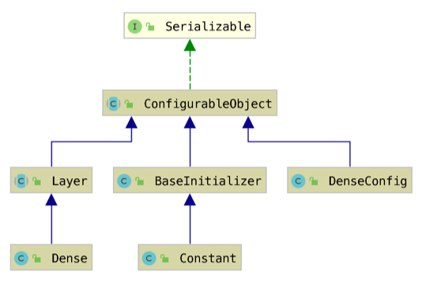

# KerasGUI

## 需求分析

Keras 是构建在 tensorflow 上的高级神经网络 API，具有用户友好、模块化、易拓展等特点，在快速构建神经网络应用时得到了广泛应用。
但在使用 Keras 的过程中，我们发现了如下问题:

1. 为了编写一个完整的神经网络，需要写大量的重复代码。
2. Keras 中的每种层都具有大量可设置的参数，在代码里进行参数设置非常麻烦。
3. 不能在编程时直接看到网络的架构。

为了解决这些问题，我们产生了为 Keras 构建一个 GUI 客户端的想法，我们实现了如下功能：

1. 网络可视化
2. 可视化进行模型参数选择
3. 代码自动生成与集成化开发环境

## 系统设计

### 如何在 Java 中表示 Keras 模型

Keras 提供了方便的模型序列化与反序列化接口，支持将模型序列化到 JSON 或 YAML 格式。在调研了已有的库后，我们选择了 JSON 格式进行代码生成。

为了最大化代码重用，我们选择按照 Keras 的 JSON 格式安排表示相关配置项的类布局，从而可以方便的使用反射和注解进行对象序列化与属性的获取。

### 如何进行网络可视化

我们实现了一个简单易用的网络构建工具，可以所见即所得地进行网络组件的连接，模型的搭建，并提供了一定的模型合法性检查，比如模型应为有向无环图。

### 如何进行可视化模型参数选择

我们按照 Keras 的 JSON 格式安排了相关配置项的类布局，并且利用反射和注解，提供了一些接口来进行参数的遍历、选项的获取与设置，在 GUI 部分可以方便的使用相关接口获取到所有的参数及其期望输入，从而动态绘制相关配置项。

### 如何提供集成化开发环境

我们采用用户代码与生成代码相混合的方式，由我们的系统生成 JSON 格式的模型，并利用 `tf.keras.models.model_from_json` 接口将其转换为 Keras 模型。
用户可以直接在自己的代码中调用该模型。

我们提供了运行选项，我们的程序会查找系统中可用的 Python 解释器并调用生成的代码，其输出将被直接打印在标准输出流和标准错误流中。

我们的编辑器也提供了简单的代码高亮功能来辅助用户代码的编写。

我们允许将工程整个保存到硬盘，允许从硬盘中读取并恢复，该过程直接使用 Java 的序列化完成。

## 代码实现 (包名均忽略前缀)

### 模型表示

#### UML 图（简化版）



#### `layers.annotation.*`

提供了各种不同的注解来支持 Keras 的不同格式的选项。

#### `layers.ConfigurableObject`

这个文件为所有 Keras Object 的子类，它利用反射读取所有的域并进行相应初始化。并且提供了获取域信息的接口，均利用反射实现。

#### `layers.ClassUtils`

一些进行反射操作的实用函数。

#### `layers.Pair`

一个 Pair 类。

#### `layers.UniqueNameGenerator`

这个文件为 `UniqueProperty` 提供支持，提供了一个不重复的字符串名字生成器。

#### `layers.layers.Layer`

所有 Keras 层的公共基类，提供对 Keras JSON 内部链接格式的支持。

#### `layers.layers.*`

已经实现的层。

#### `layers.model.Model`

Keras 模型，提供序列化到 JSON 的接口。

#### `layers.model.ModelConfig`

Keras 模型配置，提供添加删除层，链接层的接口。

#### `layers.constraint.*`, `layers.initializer.*`, `layers.regularizer.*`

Keras 内部可配置项。

### GUI 部分

#### `gui.GUI`

这个文件中有`GUI`类，这个类是整个GUI部分最骨架的一个类。这个类包含了一个`main`函数作为启动整个程序的入口，其构造函数初始化了GUI部分中的每一个子部分以及Python编辑器，并且通过菜单栏中的按钮提供了保存文件、另存为以及读入`.obj`文件的功能（`.obj`文件内容参见`SaveObject`类）以及打开Python编辑器的功能。

#### `gui.LeftBar`

这个文件中有`LeftJava`类，这个类为GUI提供了左栏的内容。左栏在整个界面中提供了所有可供选择的网络中的层（Layers）的选项，在选择了之后如果按下中间部分的`Create`按钮后，即会在中间栏中绘制者那一层，并在右边栏中显示这个层当前状态下所有的属性并且根据属性的类型提供对应相对应的输入方式。在`LeftBar`类中只存在一个构造函数，这个构造函数中初始化了所有的按钮并为每一个按钮设置有了一个对应的监听函数。

#### `gui.RightBar`

这个文件中包含`MyTextField`类与`RightBar`类。

#### `gui.Editor`

这个文件中有`Editor`类，主要给用户提供一个简易的代码编辑环境。用户搭建完网络时，即可打开该编辑器，此时编辑器能显示出已经生成的代码。接着用户便可利用已经生成好的`model`继续进行自己的工作。该编辑器提供了代码高亮、自动补全以及自动缩进等功能，在不同的系统中都能正常运行。每当用户改变已经搭好的网络，通过点击编辑器的`refresh`按钮，便可实现`model`的实时更新。

#### `gui.MyTextfield`

这个类继承自`JTextField`类，相较于`JTextField`类，这个类封装了`pos`属性用于`RightBar`类中对`int`数组类型的属性的处理。

#### `gui.RightBar`

这个类利用`refresh`函数从`Center`类与`LeftBar`类中获取表示某一层的`Layer`类对象，通过递归的方式获取这个层的所有属性，并且根据解析每一个属性的类型、可提供的选项与默认值，将这个属性在`RightBar`中以某种按照特定的方式显示出来。

每当在GUI输入或者更新完一个属性的值了过后，`RightBar`会检测输入值的有效性，例如`int`类型的属性要求输入必须为`int`值，如果输入无效将会自动的将值恢复成之前的值；输入有效后，`RightBar`将会直接将值写进对象中。

由于有一些属性的值在更新后会提供另外的一些选项，例如`kernal_initializer`属性在更新后，某些属性会消失，同时某些属性又会重新出现，因此`RightBar`提供了实时的更新功能；同时根据选项数量的多少及时调整是否显示滚动条。

#### `gui.Center(Center.java)`

这个类定义了GUI中间部分的布局，上半部分为功能区，设置了`Create`，`Add Line`，`Delete Line`三种可选功能；下半部分为操作区，供设计图结构。

本类中还定义了`toCenter`，`getBack`，`ModifyLine`功能， 分别用于从`LeftBar`处接受model对象，和根据`SaveObject`类对象恢复图结构，以及根据当前的eventNumber进行对应的修改线操作。

#### `gui.MyJpanel(Center.java)`

这个类继承自JPanel类，实现画线操作，同时存储了可以添加的button的最大纵坐标的值，以方便加入滚动条至此面板。

#### `gui.LineParameter(Center.java)`

这个类存储了`Line`的参数，即起止的button，方便画线。

#### `gui.MyActionListener(Center.java)`

这个类定义了功能区三个按钮分别对应的事件响应，即`Create`，`Add Line`，`Delete Line`三种可选功能。

`Create`对应的事件为创建并显示一个button对象，将其与底层的layer关联，并将该layer加入网络结构中，同时对应save操作将其加入到SaveObject中。

`Add Line`对应的事件为在用户指定的两个button间连线，因此需要用户在点击该按钮后，依次点击button A 和 button B, 需注意连线是有指向性的，即由 A 到 B。

`Delete Line`对应的事件为删除用户指定的两个button之间的连线，操作方法同上。

#### `gui.MouseEventListener(Center.java)`

这个类中定义了一系列关于操作区中button对象的鼠标操作，主要包括点击左键，点击右键，以及鼠标拖动。

点击左键会在`LeftBar`中显示该button对应的layer的信息。

点击右键会删除button以及其相关联的line，并且将对应的底层的layer对象从网络结构和`SaveObject`对象中移除。

鼠标拖动可以将button移动到操作区的任意位置，同时连线会根据新位置自动重绘。


### 持久化

#### `fileio.SaveObject`

保存了用来恢复现场的全部信息。

## 项目可扩展性

我们完全使用反射和注解实现了 layers 包，并从中获得了极高的可扩展性。

目前我们只实现了四种层：`Dense`(全连接层)，`Conv1D`(卷积层)，`InputLayer`(输入层)，`Add`(加层，多输入单输出)，但是我们的项目可以很容易地被扩展到更多种类的 Keras 层上，只需要：

1. 创建一个类 `SomeLayer` 继承自 `Layer` 类。
2. 创建另一个类 `SomeLayerConfig` 继承自 `ConfigurableObject` 类。
3. 在 `SomeLayer` 里面提供正确注解的 `class_name` 和 `config`。
4. 按照 Keras JSON 规范填写 `SomeLayerConfig` 类定义，只需要对每个域提供合适的注解。
5. 在 `LeftBar` 中添加新的按钮。

例：
```java
public class Add extends Layer {
    @Expose
    public final String class_name = "Add";

    @ConfigProperty
    @Expose
    public AddConfig config;
}


public class AddConfig extends ConfigurableObject {
    @LinkedProperty(name = "name")
    @UniqueProperty(scope = "name", prefix = "add")
    @ConfigProperty
    @Expose
    String name;

    @ConfigProperty
    @Expose
    boolean trainable = true;

    @ConfigProperty
    @SelectStringProperty(selections = {"float32", "float16"})
    @DefaultStringProperty(defaultString = "float32")
    @Expose
    String dtype;
}
```

同时我们只实现了 Keras 的约束(constraint)，初始化器(initializer)和正则化器(regularizer)，如果需要增加其他的 Keras 可配置对象，只需要：

1. 提供一个 `BaseSomeObject` 类继承自 `ConfigurableObject` 类，该类不应当有任何非静态域，提供 `String getSelections()` 和 `BaseSomeObject select(String)` 静态方法，`getSelections()` 返回所有选项的字符串形式，`select`根据字符串创建对象。
2. 对于具体的 `SomeObject`，使之继承自 `BaseSomeObject` 类。

例：

```java

public class BaseRegularizer extends ConfigurableObject {

    public final static Map<String, Class<?>> map;

    static {
        map = new HashMap<>();
        map.put("None", null);
        map.put("L1L2", L1L2.class);
    }

    public static String[] getSelections() {
        String[] ret = new String[map.size()];
        map.keySet().toArray(ret);
        return ret;
    }

    public static BaseRegularizer select(String str) {
        if (map.containsKey(str)) {
            Class<?> cls = map.get(str);
            if (cls == null)
                return null;
            try {
                return (BaseRegularizer) cls.newInstance();
            } catch (Exception ex) {
                ex.printStackTrace();
                System.exit(-1);
            }
        }
        return null;
    }
}


public class L1L2 extends BaseRegularizer {
    @Expose
    public final String class_name = "L1L2";

    @ConfigProperty
    @Expose
    L1L2Config config;
}


public class L1L2Config extends ConfigurableObject {
    @ConfigProperty
    @Expose
    double l1 = 0.0;

    @ConfigProperty
    @Expose
    double l2 = 0.0;
}
```

## 项目管理

项目采用 maven 管理，为标准 maven 项目，可以容易地用 maven 编译。

项目协作采用 git，项目地址 [https://github.com/lsrcz/KerasGUI](https://github.com/lsrcz/KerasGUI).

提供了良好的注释，对于主要代码均有完整的 Javadoc。

## 分工（各自主要工作）

- 卢思睿：Keras 数据结构，持久化（`layers` 包，`fileio` 包）。
- 张航：GUI 中左侧和右侧，以及配置菜单（`gui.{Center, LeftBar, RightBar}`）。
- 宁淳：Python 接口，持久化，图布局（`fileio` 包，`gui.Center`）。
- 陈佳玉：图布局，持久化（`fileio` 包，`gui.Center`）。
- 刘念奇：文本编辑器（`gui.Editor`）。
